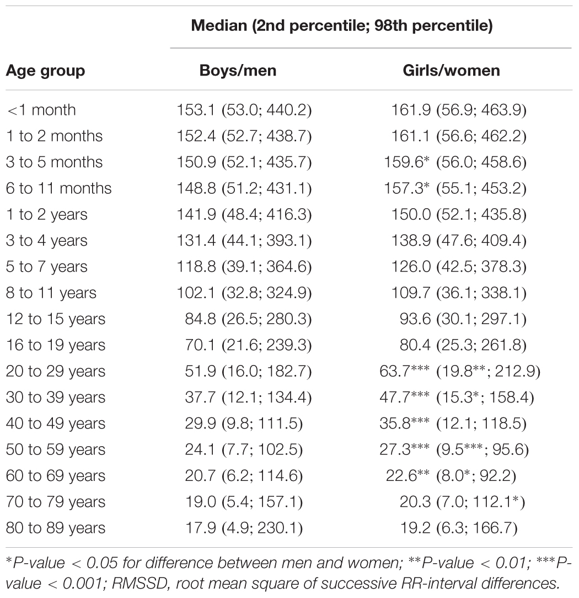

# Report Seminar Project Data Generation

## Introduction
TODO: State goal and use-case

# Synthetic Data Generation

## Introduction

## Methods
### Training Data
https://www.physionet.org/content/nsrdb/1.0.0/
- 18 long-term ECG recordings (~24h each)
- no significant arrhythmias
- 5 men, aged 26 to 45
- 13 women, aged 20 to 50
- 18 24h recordings $\rightarrow$ 155 520 training samples à 10sec, ~8200 samples per person

### Evaluation of Generated Data

<!-- ### FID
Frechet Inception Distance (FID) is a popular method for evaluating the quality of artificially generated images, and its principles can be adapted for time-series data like ECG. FID measures the distance between feature vectors calculated for real and generated data. In the context of ECG data, this involves extracting features from both real and synthetic ECG signals and comparing them using the Frechet distance. This method is particularly useful for assessing the realism and variability of generated ECG data, as it quantifies how well the synthetic data represents the distribution of the real data. FID is effective in detecting inconsistencies and artifacts in generated time-series data, offering a robust way to evaluate the performance of generative models in medical data synthesis. -->

#### DTW
Dynamic Time Warping (DTW) is a technique often used for measuring similarity between two temporal sequences which may vary in speed. For evaluating ECG data, DTW can be particularly effective as it aligns sequences that differ in length or timing, making it well-suited for comparing real and generated ECG waveforms. This method works by finding the optimal match between two given sequences, allowing for stretching or compressing sections of the data to achieve an optimal alignment. DTW is valuable for assessing the temporal dynamics and morphological characteristics of generated ECG signals, as it highlights discrepancies in waveform features like peaks, intervals, and overall rhythm. Its ability to handle non-linear alignments makes it a strong tool for evaluating the temporal fidelity of synthetic ECG data.

#### BPM, HRV
https://www.ncbi.nlm.nih.gov/pmc/articles/PMC5624990/#:~:text=used%20in%20biofeedback.-,RMSSD,of%20the%20total%20is%20obtained.
https://readthedocs.org/projects/python-heart-rate-analysis-toolkit/downloads/pdf/latest/ 

Plausibility and utility can be assessed through typical physiological markers, such as beats per minute (BPM) and the heart rate variability (HRV). For evalutation of these metrics the python library `Heartpy` was used to automatically calculate them over generated input. The BPM measure is less significant, since the heart rate is artificially altered later in the post-processing of the generated data. Still, it is worth considering, since it can give some insight into whether or not beats are properly detected.\\
The HRV is a significant metric, since it can help identify generated data that is too regular or too irregular. Heartpy calculates a number of different HRV statistics but for the purpose of model evaluation, the RMSSD value was used. This marks the root mean square of successive differences between normal heartbeats [<!-- cite: Shaffer F, Ginsberg JP. An Overview of Heart Rate Variability Metrics and Norms. Front Public Health. 2017 Sep 28;5:258. doi: 10.3389/fpubh.2017.00258. PMID: 29034226; PMCID: PMC5624990., with healthy ranges between  -->], with healthy value ranges shown in the following table:

  

<!-- cite: https://www.frontiersin.org/articles/10.3389/fphys.2018.00424/full -->

#### Visual Inspection
While Dynamic Time Warping (DTW) provides a quantitative assessments of artificially generated data, visual inspection remains crucial due to the complexity and nuanced nature of ECG data. The metric cannot capture clinically significant problems or improvements in ECG waveforms. Visual inspection enables the identification of such details, ensuring that the generated data statistically aligns with real data and also adheres to physiological patterns. This combination of quantitative metrics and qualitative visual evaluation offers a more comprehensive and reliable approach to assessing the quality of artificially generated ECG data.

### Model Types
#### GAN
Several GAN architectures were tried, the best performing (in terms of subjective human judgement) is detailed below. The GAN generates 10 second ECG records, which can then be added together in order to generate longer ECG signals as needed.

##### GAN Architecture 1
##### GAN Architecture 2

##### Input/Output Specifications
- Discriminator Input: Real or fake ECG signals of shape (1000, 1).
- Generator Input: Random noise vectors of shape (100,).
- Discriminator Output: A probability score (0 to 1) indicating the likelihood of the input being a real ECG signal.
- Generator Output: Synthetic ECG signals of shape (1000, 1).

##### Training

The GAN is trained through a competitive process where the Generator and Discriminator are simultaneously updated:

1. Fake Signal Generation: The Generator creates ECG signals from random noise.
2. Combining Real and Fake Signals: These are mixed with actual ECG signals.
3. Discriminator Training: The Discriminator is trained to distinguish real signals from fake ones. The loss is calculated based on its ability to correctly classify these signals.
4. Generator Training: The Generator is updated based on the Discriminator's performance, with the aim to improve its ability to generate realistic ECG signals that can fool the Discriminator.
5. Repeat: The training process is iterative, with both networks improving over time through adversarial training.

<!-- #### VAE -->

#### TimeVAE

### Results

#### GAN Architecture 1
##### Generated Sequences
One sample vs all samples

##### Evaluation
While there are observable differences between the ECG signals generated from different models, the variation of generated sequences from a single model is negligible. This is due to mode collapse, a common problem with GANs. On one hand, this is not unrealistic, as the ECG signals from a single patient typically ressemble one another quite closely, whereas signals recorded from different patients are usually quite distinct. However, the signals generated from this GAN are too regular: There is almost no heart rate variation.

A positive feature of the generated sequences is that some of them contain noise/artifact, as do real ECG signals, which adds some realism to the generated signals. 

#### GAN Architecture 2
##### Generated Sequences
One sample vs all samples

##### Evaluation

#### TimeVAE
##### Generated Sequences
##### Evaluation

### Discussion

# Web Application

TODO: Explain use-case, list tech stack

### Frontend
The simple frontend is implemented in React. It features a form with three input fields: a time input for "Length of Recording" formatted as minutes and seconds, a dropdown selection for "Type" of recording, and a numerical input for "BPM" (beats per minute). There are also two buttons: one to "Generate" the recording and another to "Download File", which appears once the generated file is ready.

### Backend
The backend of our web application serves as the API layer, built using Flask, a lightweight and versatile web framework in Python. This component is responsible for handling HTTP requests from the frontend, processing these requests, interfacing with the TensorFlow Serving component for model inferences, and returning the appropriate responses.

More precisely, it runs inference on the model served through TF Serving, concatenates generated sequences to the desired length, and modulates heart rate accordingly.

The generated file is provided for download through the frontend.

### Model Serving

The app implements a robust model serving architecture utilizing TensorFlow Serving, which is specifically engineered to serve machine learning models in a production environment.

The machine learning models are stored on a persistent filesystem and are accessed by the TF-Serving container. TensorFlow Serving is configured via a models.config file, which specifies the names and filesystem paths of the models to be served. The configuration allows TensorFlow Serving to automatically detect and serve multiple models, handling requests for different models and model versions.

Upon receiving an inference request, the Backend Service sends a RESTful API call to the TF-Serving service. The request includes the model name and the input data for inference. TensorFlow Serving processes the request, performing the inference using the specified model, and returns the prediction results to the Backend Service, which then relays them to the client.

The architecture supports concurrent processing of multiple models and versions, enabling horizontal scalability and redundancy. This is crucial for high availability and to handle potential spikes in request volume.

### Containerization
